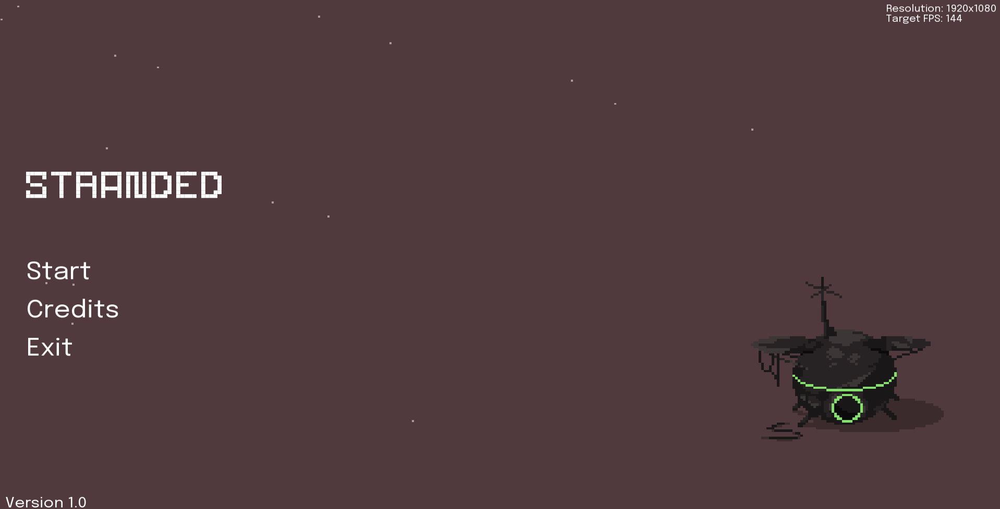
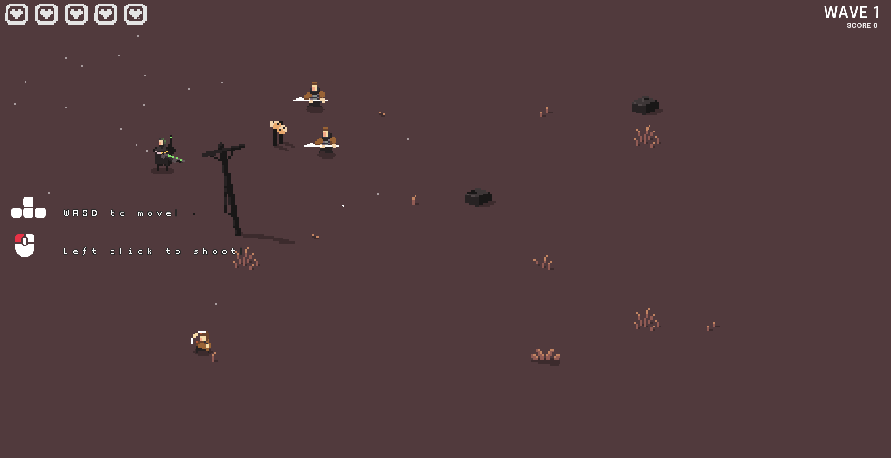
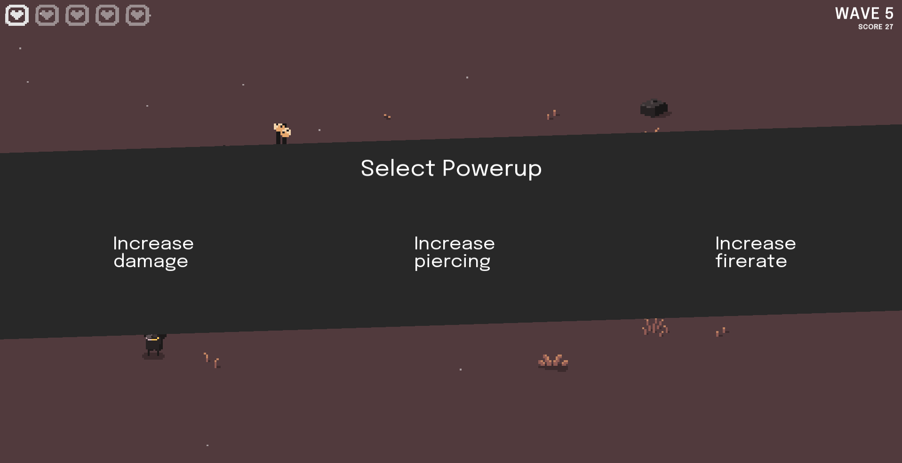

# Stranded


A top-down, endless wave survival, shooter game made using C++ and [SFML](https://www.sfml-dev.org/index.php). No game engine was used in making the game. The game includes systems/features like
- Asset management
- Collision detection
- Sound effects/Music
- Scene management
- Basic GUI
- Animations

## Screenshots




## Compile
Compile the project using
```cpp
g++ .\main.cpp -I SFML\include\ -L SFML\lib\ -DSFML_STATIC -lsfml-main -lsfml-graphics-s -lsfml-window-s -lsfml-audio-s -lsfml-system-s -lopengl32 -lfreetype -lwinmm -lopenal32 -lflac -lvorbisenc -lvorbisfile -lvorbis -logg -lgdi32 -static-libstdc++ 
```
And run the executable using 
```
./a.exe
```


